# La Conjetura de Collatz y sus extensiones
 Aplicaciones escritas en Python

## Introducción
La Conjetura de Collatz se plantea en el conjunto de los números enteros positivos $\mathbb{N}+1= \lbrace 1, 2, 3, ... \rbrace$ de forma muy simple: Se define una función $C(n)$ (función de Collatz) que da como resultado 
n/2 si n es un número par y 3·n + 1 si n es un número impar.   
**Conjetura**: *Aplicando C reiteradamente a cualquier n siempre llegamos a obtener 1.*  
Por ejemplo, si n = 3 obtenemos la secuencia: [3, 10, 5, 16, 8, 4, 2, 1].

En lenguaje matemático podemos escribirlo de la siguiente forma:

$$C(n)=\begin{cases}
n/2 & \quad n \equiv 0 \pmod 2 \newline
3n + 1 & \quad n \equiv 1 \pmod 2
\end{cases}$$

Donde $a \equiv b \pmod c$ se lee: "a es congruente con b módulo c". 
Esto significa que "a" y "b" dan el mismo resto cuando se realiza su división entera euclídea entre "c". 
Es frecuente utilizar el valor del resto como valor de "b" en esta expresión. 
En este caso, en la programación de esta fórmula, también es frecuente utilizar 
la expresión "b = a % c", que se lee: "b es el resto de la división entera de a entre c".

## Generalidades
En la carpeta "naturales" se encuentran los programas Coll-00 y Coll-01 que generan las secuencias de Collatz 
de n (siendo n el número natural que se entra al solicitarlo el programa). 
Comentarios a las diferencias entre ambos programas:
- En Coll-01 se supone cierta la Conjetura de Collatz y por eso se finaliza la búsqueda cuando se obtiene el valor 1.
- En Coll-00 la búsqueda finaliza cuando se entra en un ciclo (valores que se repiten indefinidamente). 
Teoricamente funciona aunque no sea cierta la Conjetura de Collatz. El número 1 forma parte del ciclo: $\langle 4, 2, 1 \rangle$.
- El programa Coll-00 es extensible a lo números enteros, pero tanto para los números negativos como para el número 0 tiene otros ciclos terminales diferentes de $\langle 4, 2, 1 \rangle$. Este aspecto lo veremos con más detalle en la extensión a los números enteros.

## Ciclos
Las sucesiones de números naturales generadas por la aplicación reiterada de la función C(n) puede comportarse de dos formas:
- Entrando en un ciclo que se repite de forma indefinida. Caso del ciclo $\langle 4, 2, 1 \rangle$ (también llamado ciclo trivial).
- No repitiendo nunca ningún número, lo que conduce a la producción de números muy grandes. Divergencia.

La Conjetura de Collatz equivale a decir que no hay divergencias y que siempre terminamos en el ciclo $\langle 4, 2, 1 \rangle$.
Por lo tanto, una forma de demostrar que la Conjetura no es cierta sería encontrar un contraejemplo. Es decir encontrar otro ciclo diferente del trivial o encontrar una sucesión divergente.  
Para demostrar la inexistencia de ciclos diferentes del trivial se pueden seguir diferentes estrategias. La más directa es clasificar los ciclos por su longitud y demostrar que no existen ciclos de longitud s para cualquier valor de s.

**Propiedades de los ciclos**: 
1. *Estabilidad*: Dado un ciclo $\mathcal{C} = \langle a_1, a_2, ..., a_s \rangle$, si le aplicamos la función de Collatz obtenemos 
$\langle a_2, a_3, ..., a_s, a_1 \rangle$ que contiene los mismos elementos que el ciclo anterior. A esta propiedad se le llama estabilidad de la función de Collatz respecto a los ciclos.
2. *Relación entre pares e impares*: Sea $(b_1, b_2, ...,b_p)$ la lista de elementos pares y 
$(c_1, c_2, ..., c_q)$ la lista de elementos impares, con 
$s=p+q$. 
Si escribimos la lista completa 
$(b_1, ..., b_p, c_1, ..., c_q)$ 
vemos que no es más que un reordenamiento de 
$\mathcal{C}$. 
Aplicandole la función de Collatz tenemos 
$(b_1/2, ..., b_p/2, 3c_1 +1, ..., 3c_q +1)$
, que sigue teniendo los mismos elementos que 
$\mathcal{C}$. Por último, si cálculamos el producto de todos los elementos del ciclo 
$b_1 ... b_p c_1 ... c_q = \frac{b_1}{2} ... \frac{b_p}{2} (3c_1 +1) ... (3c_q +1)$ y simplificando: 
$$2^p=\left( 3+\frac{1}{c_1}\right) ... \left( 3+\frac{1}{c_q}\right)$$

**Ciclos de pequeña longitud**:

Para n=1 la fórmula anterior no es compatible. Debe cumplirse: 0 < p < s  
Para n=2 la fórmula anterior no es compatible. Por la misma razón.   
Para n=3 es compatible con p=2 y q=1 [$2^2=(3+1/1)$], 
que coincide con el ciclo trivial $\langle 4, 2, 1 \rangle$.  
Para n=4 con p=1 es incompatible ya que $2 < (3 + ...)(3 + ...)(3 + ...)$  
Para n=4 con p=2 es incompatible ya que $2^2 < (3 + ...)(3 + ...)$  
Para n=4 con p=3 es incompatible ya que $2^3 > (3 + 1/r)$ para cualquier r natural.  
Para n=5 partiremos del ciclo escrito con $a_1$ como elemento mínimo y, 
por lo tanto, impar. Con esto tenemos $a_2=3a_1 + 1$, que será par, 
y $a_3=a_4/2$. Si $a_3$ fuera par $a_4=a_3/2=a_2/4=(3a_1 +1)/4$ 
que implica $a_4 < a_1$ que contradice que $a_1$ sea el mínimo. 
Por lo tanto, $a_3$ debe ser impar y $a_4=3a_3 +1$ será par, 
con lo que $a_5=a_4/2$. Vemos que $a_5$ debe ser par, ya que $a_1 < a_5$, 
por ser $a_1$ el mínimo, lo que solo es posible con $a_1=a_5/2$.
Finalmente el producto de todos los elementos del ciclo tendrá la forma: 
$a_1 a_2 a_3 a_4 a_5 =\frac{a_5}{2} (3a_1 +1)\frac{a_2}{2} (3a_3 +1) \frac{a_4}{2}$, 
que simplificando queda: $8=(3+\frac{1}{a_1})(3+\frac{1}{a_3})$, pero esta condición 
no se puede cumplir con $a_1$ y $a_3$ naturales, ya que 8 < (3 + ...)(3 + ...). 
Por lo tanto, no existen ciclos de longitud 5.  
Sin embargo, sí es compatible con los enteros negativos, donde existe un ciclo de longitud 5
 tal y como veremos en el apartado dedicado a las extensiones.

## Representaciones
**Representación directa de las secuencias de Collatz**

Partiendo del programa Coll-01.py y añadiendole el módulo PyPlot de la biblioteca MatplotLib, para dibujar las secuencias de Collatz en lugar de imprimirlas, tenemos el programa F-Coll-01.py con las siguientes salidas:

Para n = 7:

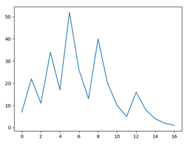

Para n = 27:

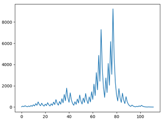

Se observa un comportamiento de bruscas subidas y bajadas, lo que se conoce con el nombre de trayectoria de granizo (similar a lo que les ocurre a las gotas de granizo en el interior de las nubes).  
Estas trayectorias (representaciones gráficas de las secuencias) están enmarcadas por dos valores: Valor máximo (ordenadas) y número de iteraciones para alcanzar el valor 1 (abscisas). Ambas variables tienen comportamientos peculiares.

**Valores máximos de las secuencias**

Llamaremos faros tipo 1 a estos números, ya que parecen delimitar (acotar) el terreno en el que mueven estas secuencias. Luego veremos otros delimitadores (faros de diferentes tipos) que también acotan diferentes parámetros característicos de estas secuencias.  
El programa Faros1-01.py hace un barrido de las secuencias de 1 a n y guarda los máximos para proceder a dibujarlos.

Para n = 400:

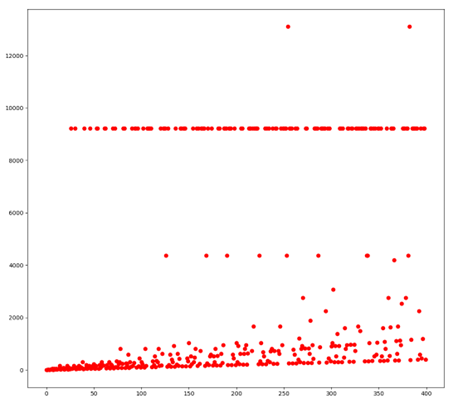

Para n = 400 se observan agrupaciones de puntos en líneas horizontales (13.120, 9.232, 4.372, …) y en líneas inclinadas (y = x, y = 3x + 1, …). Sugiere la existencia de algo parecido a un espectro (algo que se obtiene mediante una transformación del conjunto de secuencias).

Llamaremos Faros tipo 2 a los primeros valores de la secuencia que son inferiores al valor inicial. La existencia de estos valores es equivalente a la no divergencia de la secuencia.  
El programa Faros2-01.py hace un barrido de las secuencias de 1 a n y guarda estos valores para proceder a dibujarlos.

Para n = 1000:

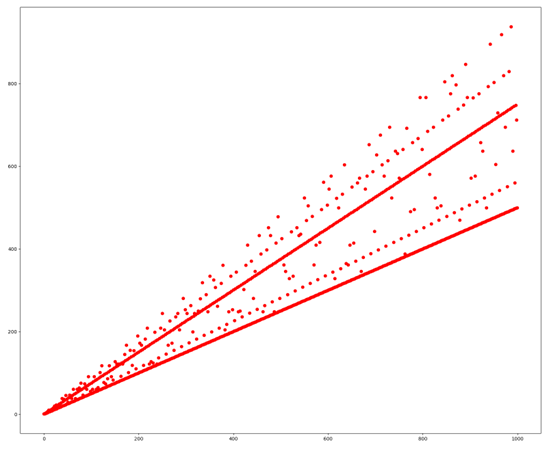

**Números de iteraciones**

La longitud de la secuencia o número de iteraciones hasta obtener el valor 1, también se conoce con el nombre de tiempo de parada (stopping time). Parece tener una cota superior que crece muy lentamente y que se dispersa progresivamente. La Conjetura de Collatz es también equivalente a decir que *cualquier entero superior a 1 tiene un tiempo de parada finito*.  
El programa Tiempos-00.py calcula estos valores haciendo un barrido de 1 a n.

Para n = 20.000:

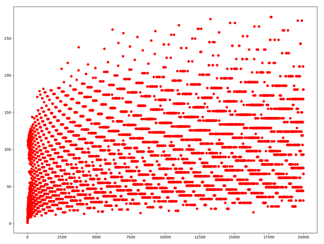

También es interesante ver el comportamiento del tiempo hasta llegar a los diferentes Faros.  
El tiempo para llegar a los Faros de tipo 1 se reduce notablemente respecto a los tiempos de parada (ver el programa TienposF1-00.py).

Para n = 20.000:

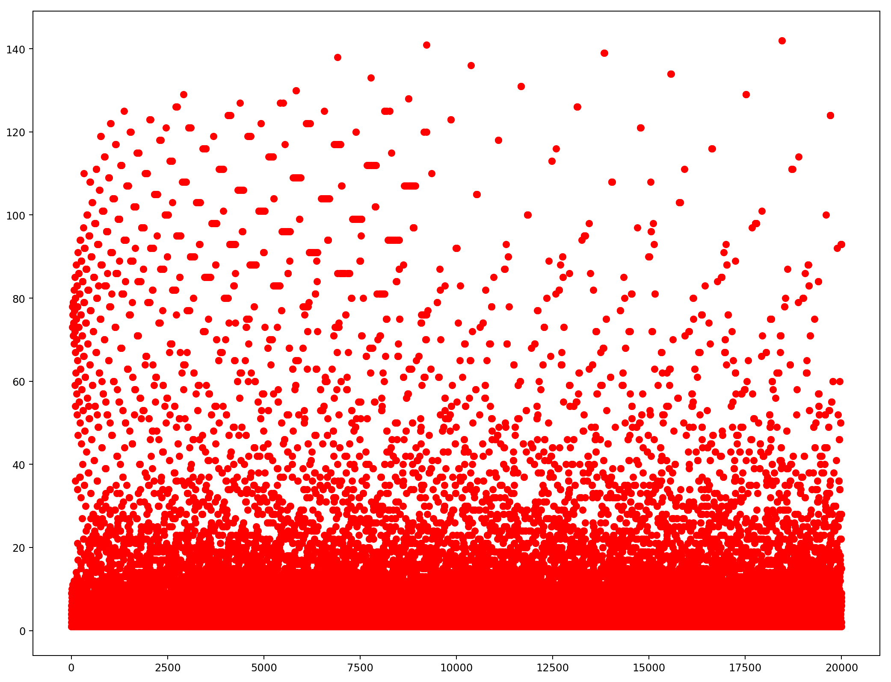

El tiempo para llegar a los Faros de tipo 2 vuelve a reducirse. 

Para n = 20.000:

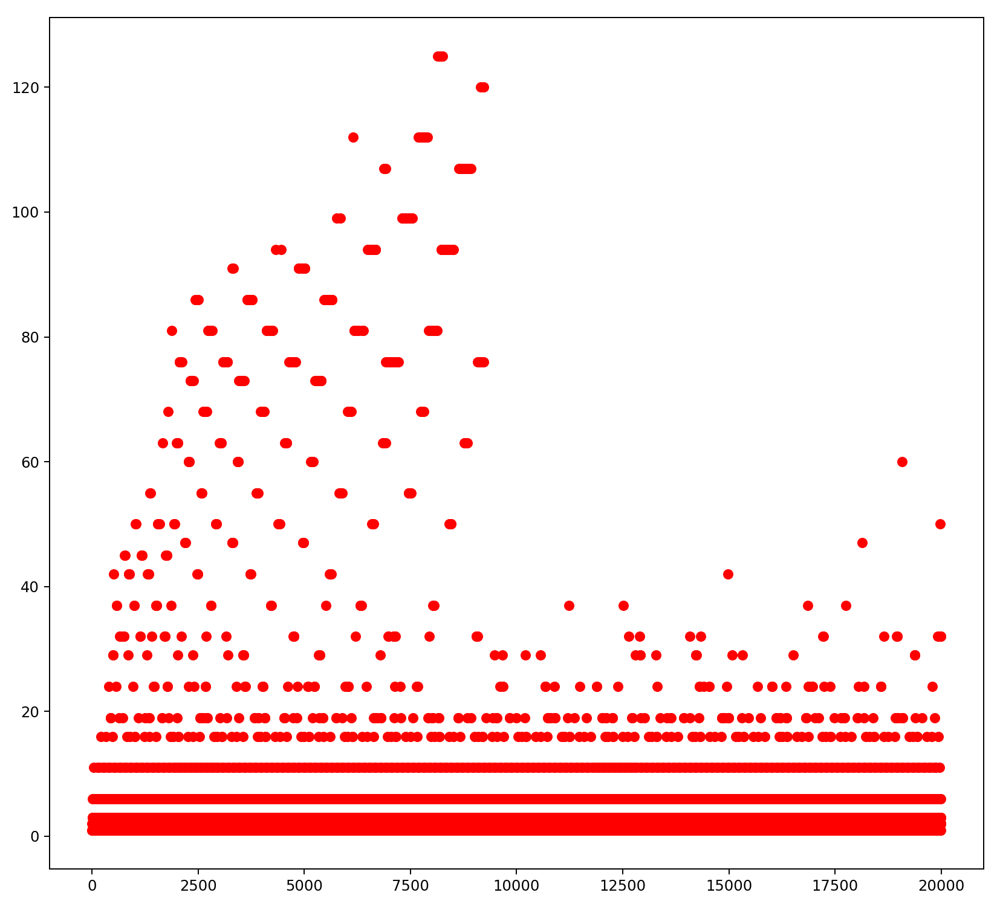

Este efecto parece paradójico, ya que las reducciones antes de alcanzar el máximo parecen indicar que el máximo se consigue después de haber bajado del valor inicial. Es decir, primero hay bajadas o subidas seguidas de bajadas hasta valores inferiores al valor inicial y posteriormente nuevas subidas hasta alcanzar el máximo. Pero, si estos máximos se obtienen en valores inferiores al valor inicial actual, parece lógico pensar que deberían estar en la gráfica para valores iniciales anteriores. Sin embargo este "parece" no es real ya que no estamos mirando los máximos sino los valores del Faro de tipo 2.  
En resumen, parece que hay la posibilidad de encontrar un argumento recursivo que nos conduzca a encontrar una función límite de los tiempos de los diferentes Faros.

**Grafos de Collatz**

Las secuencias de Collatz pueden verse como ramas (conjunto conectado de vértices mediante aristas) de un grafo dirigido, donde el vértice origen de cada arista tiene la etiqueta n y el vértice destino tiene la etiqueta C(n), siendo C(n) el resultado de la función de Collatz. Por lo tanto, el conjunto de ramas da lugar a un grafo que representa todas las secuencias.
Retomando el programa Coll-00.py y utilizando el módulo Digraph de la biblioteca graphviz podemos construir el programa G-Coll-00.py (incluido en la carpeta "naturales").

En la función GrColl(n, aristas) se construye el grafo, para ello se crea un contenedor de vértices “s” en el que se incluyen los nuevos vértices sin repetirlos. Para evitar las repeticiones usamos la función “n not in s” vista anteriormente. Las aristas se construyen uniendo el vértice origen con el vértice destino (antes y después de aplicar la función de Collatz). Hay dos bucles, el exterior para fabricar todas las secuencias (de 1 a n) y el interior para cada secuencia (la parte que aún no se ha incluido en secuencias anteriores).
Es importante observar que la función “GrColl” devuelve el parámetro “aristas” modificado, ya que al tratarse de una lista es un parámetro mutable. Por dicho motio no se requiere una instrucción “return”.
El grafo obtenido se guarda en un archivo png temporal que se muestra en una ventana usando la opción “view = True”.

Para n = 7:

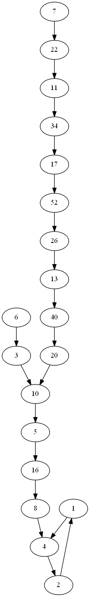

Los grafos obtenidos de esta forma son muy asimétricos. Utilizando la relación inversa de Collatz se pueden obtener grafos con un aspecto mucho más simétrico haciendo crecer las ramas de manera uniforme.

**Collatz inverso**

La relación inversa de Collatz no es unívoca, puede dar lugar a uno o dos valores según el tipo de vértices que estemos analizando. Por ejemplo, en el grafo anterior el vértice 10 da lugar a los valores 3 (3·3+1 = 10) y 20 (20/2 = 10), mientras que 3 solo da lugar a 6 (6/2 = 3) ya que x·3 + 1 = 3 implica x = 2/3 que no es un número natural.  
Si consideramos tres vértices del grafo (a, b, c) conectados de la siguiente forma: a→c,b→c es evidente que si “a” es par, “b” debe ser impar, y al contrario ( si “a” es impar, “b” debe ser par). Tomemos el primer caso (“a” par), para que estos tres vértices existan se debería cumplir: “a = 2·c” y “b = (c – 1)/3”, pero para un “c” arbitrario no siempre existirá un valor “b” que cumpla esta condición y que sea impar. En conclusión “a” siempre existe y “b”, dependiendo del valor de “c”, puede existir o no. Evidentemente el mismo razonamiento vale para para el caso “a” impar (intercambiando los papeles de “a” y “b” en el razonamiento anterior).  
La condición (c – 1)/3 entero equivale a “c%3 = 1” y la condición “[(c – 1)/3]%2 = 1” (impar) equivale a “c%2 = 0” cuando existe (c – 1)/3 entero (es decir c%3 = 1). Las condiciones “c%3 = 1” y “c%2 = 0” conjuntamente equivalen a “c%6 = 4”. Tabla explicativa:

| Módulo | resto | resto | resto | resto | resto | resto |
| -- | -- | -- | -- | -- | -- | -- |
| %3 | 0 | 1 | 2 | 0 | 1 | 2 |
| %2 | 0 | 1 | 0 | 1 | 0 | 1 |
| %6 | 0 | 1 | 2 | 3 | 4 | 5 |

$$C^{-1}(n)=\begin{cases}
\lbrace 2n, (n-1)/3 \rbrace & \quad n \equiv 4 \pmod 6 \newline 
\lbrace 2n \rbrace & \quad  n \not\equiv 4 \pmod 6 
\end{cases} $$

El programa G-Coll-Inv-00.py utiliza la relación inversa de Collatz y la búsqueda de vértices por el método de los niveles. El método de los niveles es adecuado para la búsqueda de vértices en un grafo con estructura de árbol. En este caso tenemos el bucle final que lo complica, pero lo hemos evitado excluyendo el vértice 1 en la búsqueda de impares y lo hemos restituido en el programa principal.

Para una profundidad d = 11:

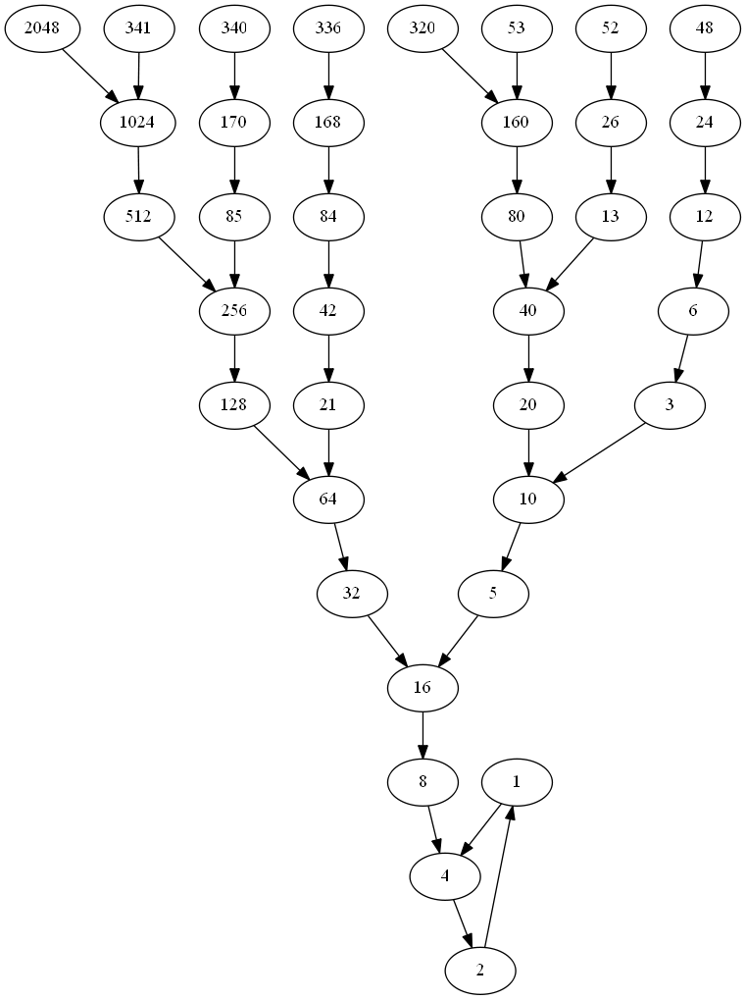

**Aspectos topológicos del Grafo de Collatz**

Como **aspecto global** podemos decir que si existe otro ciclo o alguna rama que diverge al infinito, tendremos una partición de los números naturales (una parte por cada ciclo diferente y una parte por cada rama independiente que tienda al infinito). Por lo tanto, podemos decir que la *Conjetura de Collatz es equivalente a que su grafo dirigido sea débilmente conexo* (es decir, que el grafo no dirigido subyacente sea conexo). También es equivalente a decir que *todos los números naturales se pueden obtener aplicando reiteradamente la relación inversa de Collatz*. En lenguaje matemático:
$$\forall n \in \mathbb{N}, \exists k \in \mathbb{N}: n \in C^{-k}(1)$$
De otra forma:
$$\mathbb{N}=⋃_{k∈N}C^{-k}(1)$$
Cada valor k genera un conjunto finito de números naturales que podemos interpretarlo como un nivel del grafo (distancia al elemento raíz de etiqueta 1). Estos niveles definen una partición de N. Cada elemento x del nivel k también define una partición de N (todos los elementos de los niveles inferiores a k y los generados recursivamente con la relación inversa de Collatz a partir de cada x).

Como **aspecto local** vemos que cada vértice siempre tiene una salida, una entrada par y, dependiendo de su valor (si es congruente con 4 módulo 6), puede tener una entrada impar. Pero parte de esta información puede propagarse a lo largo de algunas ramas del grafo (en sentido inverso).   
Por ejemplo, si miramos la rama que parte del vértice 3 podemos observar que carece de entradas impares (la no congruencia con 4 módulo 6 se propaga a lo largo de esta rama). Efectivamente la única entrada en el vértice 3 es 6, ya que la entrada n impar sería 3·n + 1 = 3 que no es un número entero. Pero todos los vértices de esta rama son de la forma 3·2r que son congruentes con 0 módulo 6 para r > 0 y congruente con 3 módulo 6 para r = 0, por lo tanto, no cumplen la congruencia con 4. Podemos decir que se trata de una rama “pelada” (sin bifurcaciones). Vemos que se transmite la congruencia 0 módulo 6.  
Esta situación se generaliza a todos los múltiplos de tres impares (es decir de la forma 3p, siendo p cualquier impar). Efectivamente los múltiplos de 3 no son congruentes con 4 módulo 6 (los pares son congruentes con 0 y los impares con 3) y por lo tanto no pueden dar lugar a ramas impares. Los vértices de las ramas pares son de la forma 2q3p, siendo q cualquier natural, que son congruentes con 0 módulo 6 y, por lo tanto, nunca pueden dar lugar a ramas impares. Se trata de una rama “pelada”.  
Ahora veamos lo que ocurre con los números congruentes con 1, 2 y 5 módulo 6. Como no son congruentes con 4 módulo 6 solo dan lugar a ramas pares con las siguientes secuencias inversas: (1, 2, 4), (2, 4), (5, 4). Todos terminan con valores congruentes con 4 módulo 6.  
Finalmente los números congruentes con 4 módulo 6 tienen las dos ramas, la par que sigue la alternancia inversa (2, 4, 2, 4,…) y la impar que puede ser del tipo 1, 3 o 5.

**Teorema de la rama pelada**: Vemos que el vértice de llegada de la rama pelada siempre nos da el resto 3 al dividir entre 6 y los siguientes el resto 0. Es decir que *las ramas peladas finalizan con un impar múltiplo de 3*. Las ramas peladas están formadas por vértices cuyas etiquetas tienen la propiedad de ser múltiplos de 3. Los vértices con etiquetas múltiplos de 3 pares se sitúan dentro de las ramas peladas y los múltiplos de 3 impares son final de ramas peladas (es decir que los múltiplos de 3 siempre están en ramas peladas).  
**Teorema de la alternancia de las ramas pares**: El análisis anterior da una información adicional para las otras ramas pares no peladas: Se trata de la alternancia de las bifurcaciones (cada vez que encontramos un resto 4 moviendonos en sentido inverso). Efectivamente, el resto de las ramas pares (no peladas) o con final impar de tipo 1 o 5, *presentan una alternancia de bifurcaciones* en las formas (siempre moviéndonos en sentido inverso): (1, 2, 4, 2, 4, …), (2, 4, 2, 4, …), (4, 2, 4, 2, …) o (5, 4, 2, 4, 2, …). Por ejemplo, en el caso de n = 13 tenemos: (1, 2, 4, 2, 4, …).

Si damos colores a los vértices del grafo para los restos módulo 6, tenemos para d = 12:

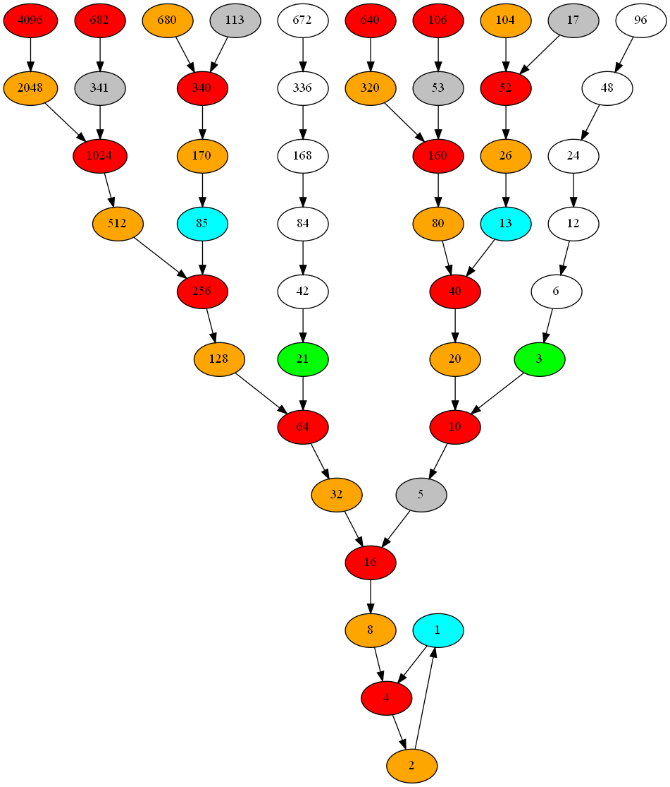

## Secuencias compactas

**Primera compactación: Secuencias de Terras**

Mirando la definición de la función de Collatz se observa que para n impar el resultado 3n + 1 es par, con lo que el paso siguiente sería (3n + 1)/2. Por lo tanto, se puede acortar las secuencias de Collatz con una nueva función (propuesta por Terras y también llamada función “atajo”):

$$T(n)=\begin{cases}
n/2 & \quad n \equiv 0 \pmod 2 \newline
(3n + 1)/2 & \quad n \equiv 1 \pmod 2
\end{cases}$$

Si comparamos las secuencias de Collatz y de Terras para el valor 7:  
Collatz: 7, 22, 11, 34, 17, 52, 26, 13, 40, 20, 10, 5, 16, 8, 4, 2, 1  
Terras: 7, 11, 17, 26, 13, 20, 10, 5, 8, 4, 2, 1  
Se observa que las secuencias de Terras son subsecuencias de las secuencias de Collatz donde se conservan todos los números impares y algunos números pares.

El programa G-Terr-00.py obtiene el grafo que contiene todos los vértices con etiqueta igual o inferior al número natural n. Para n = 7:

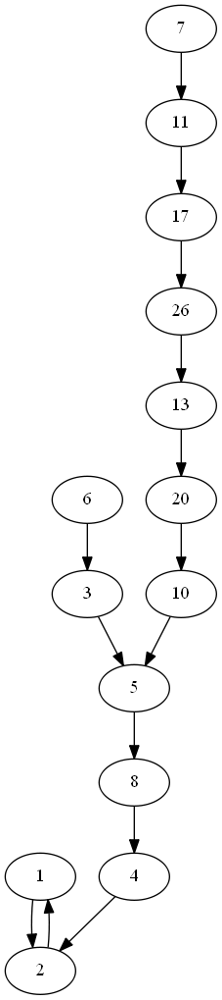

En este caso (compactación de Terras) la relación inversa será:

$$T^{-1}(n)=\begin{cases}
\lbrace 2n, (2n-1)/3 \rbrace & \quad n \equiv 2 \pmod 3 \newline 
\lbrace 2n \rbrace & \quad  n \not\equiv 2 \pmod 3 
\end{cases} $$

El programa G-Terr-Inv-00c.py genera el grafo coloreado (con los mismos criterios que el grafo de Collatz). Para d = 9:

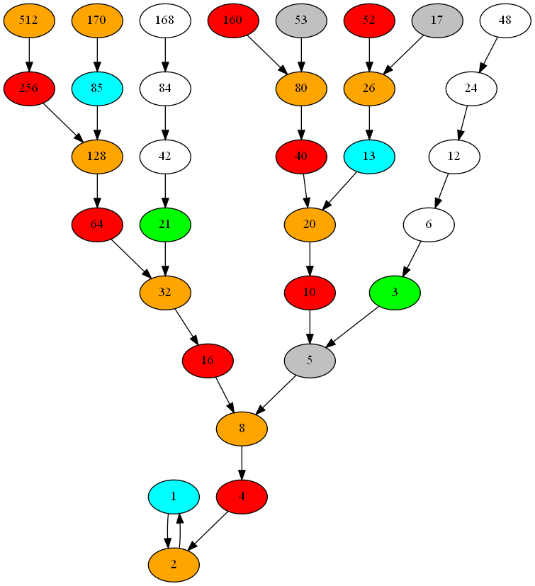

Se observa el cambio de los vértices con bifurcación en las ramas pares (en lugar de los vértices tipo 4, se bifurca en los de tipo 2) y en los vértices de tipo 5.

**Segunda compactación: Secuencias de Siracusa**

Una compactación más fuerte es la aplicación de Siracusa, que reemplaza el valor $3n + 1$ de la función de Collatz por $(3n + 1)/2^k$ siendo k la potencia de 2 más alta que divide a $3n + 1$. De esta forma la función resultante es una aplicación de los números impares en los números impares:  
$C(2\mathbb{N})→C(2\mathbb{N})$ Siendo $C(2\mathbb{N})$ el conjunto complementario de $2\mathbb{N}$ en $\mathbb{N}$. También se puede escribir $C(2\mathbb{N})=2\mathbb{N}-1$ para $\mathbb{N}=\{1,2,3,…\}$:

$$S(n)=\frac{3n+1}{2^k}$$

La aplicación reiterada de esta función a un determinado número impar nos produce la secuencia de Siracusa, equivalente a la secuencia de Collatz (o de Terras) donde se han omitido todos los números pares. *La conjetura de Collatz es equivalente a la existencia de un número q tal que para cualquier número n impar se verifica:* $S^q (n)=1$.  
El programa G-Syr-00.py genera el grafo que contiene todos los vértices impares inferiores o iguales a n. Para n = 7:

La relación inversa da como resultado una lista de vértices ascendientes en el siguiente nivel (vértices padres). Para ello hay que hacer un barrido con las potencias de 2, tal que m sea un número entero (de r = 1 a r = k, siendo k la amplitud del barrido): 

$$m=\frac{2^{r}n-1}{3}$$

El programa G-Syr-Inv-00c.py genera el grafo coloreado (con el criterio de los restos de 6) para la profundidad d y la amplitud k.  
Para d = 3 y k = 6:

Se observa que 3 y 21 no presentan ascendientes. Efectivamente, los múltiplos de 3 (n = 3·q) darían lugar a ascendientes de la forma (2r·3·q – 1)/3, pero 2r·3·q – 1 no es divisible por 3 (da un resto 2) y, por lo tanto, no existen. En el grafo de Collatz los vértices impares múltiplos de 3 eran el origen de una rama pelada (constituida de solo números pares).  
Salvo el bucle inicial (reducido al 1), el resto tiene una estructura de árbol de múltiples infinitos (cada nivel, salvo el nivel 0 y los vértices múltiplos de 3, tiene infinitos vértices, resultado de la suma de infinitos ascendientes de cada uno de los infinitos vértice, y además existen infinitos niveles). 

Para obtener una imagen más simétrica (número de ascendientes fijo, salvo para los múltiplos de 3) se puede aumentar el valor de la amplitud hasta encontrar dicho número (nuevo valor k): Programa G-Syr-Inv-01c.py.  
Para d = 3 y k = 3:

*Una propiedad interesante*: Todos los padres $\lbrace m_1,m_2,…\rbrace$ 
de un vértice n del Grafo de Siracusa están relacionados por la igualdad: $m_{i+1}=4·m_i+1$

Efectivamente dependiendo del resto de la división entera de n entre 3 tenemos:   
- Resto 0: No hay padres (teorema de la rama pelada).  
- Resto 1: $m_i=(2^{k_i} ·n-1)/3$ para $k_i=2·i,i∈\mathbb{N}$.  
    Nota: n tiene la forma 3·s+1, con lo que el numerador $2^k·3·s+2^k-1$, da un resto r congruente con $2^k-1$ mod 3 que dependiendo de k será 0 (k par) o 1 (k impar).   
- Resto 2: $m_i=(2^{k_i} ·n-1)/3$ para $k_i=2·i-1,i∈\mathbb{N}$.  
    Nota: n tiene la forma 3·s+2, con lo que el numerador $2^k·3·s+2^{k+1}-1$, da un resto r congruente con $2^{k+1}-1$ mod 3 que dependiendo de k será 0 (k impar) o 1 (k par).

En el caso resto 1: $n=(3·m_i+1)/2^{k_i}$ con $k_i=2·i , i∈\mathbb{N}$ 

> Para: $n=(3·m_{i+1}+1)/2^{k_(i+1)}$ igualando:  
$3·m_{i+1}+1=(3·m_i+1)·2^{k_(i+1)-k_i}=4·(3·m_i+1)$, $2(i+1)-2i=2$  
Es decir: $3·m_{i+1}=12·m_i+4-1=12·m_i+3⟹m_{i+1}=4·m_i+1$

En el caso resto 2: $n=(3·m_i+1)/2^{k_i}$ con $k_i=2·i-1 , i∈\mathbb{N}$

> Para: $n=(3·m_{i+1}+1)/2^{k_{i+1}}$ igualando:  
$3·m_{i+1}+1=(3·m_i+1)·2^{k_{i+1}-k_i}=4·(3·m_i+1)$, $2(i+1)-1-(2i-1)=2$  
Es decir: $3·m_{i+1}=12·m_i+4-1=12·m_i+3⟹m_{i+1}=4·m_i+1$

Que coinciden.  
Por lo tanto, una forma alternativa de obtener el grafo de Siracusa por el método inverso sería obtener el primer vértice padre y utilizar la relación anterior para obtener el resto de los vértices padres deseados.

**Tercera compactación: Secuencias Super-Sracusa**

De la misma forma que hemos pasado de los grafos de Collatz a los grafos de Siracusa, eliminando los vértices pares (proyectando sobre los impares por la división sucesiva por 2), se puede plantear un nuevo tipo de grafo (Super-Siracusa) eliminando los vértices de etiqueta múltiplo de 3, que, como hemos visto, se concentran en las ramas peladas. Es decir, un grafo sobre los impares no múltiplos de 3. Para ello basta con eliminar los múltiplos de 3, lo que equivale a evitar las ramas peladas.  

Observación: Resulta evidente que los vértices impares múltiplos de tres no forman parte de ningún bucle. Por lo tanto, la Conjetura de Collatz en su aspecto de que solo existe un bucle con el 1 sigue siendo equivalente para el nuevo conjunto Super-Siracusa.

El programa G-SSyr-00.py genera el grafo para todos los vértices inferiores a n (impar no múltiplo de 3).  
Para n =23:

Por lo indicado anteriormente sobre los vértices con etiqueta múltiplo de 3, para generar el grafo Super-Siracusa inverso basta con excluir a los múltiplos de 3 (ver programa G-SSyr-Inv_00c.py).  
Para d = 3 y k = 3:

Con lo que obtenemos un árbol equilibrado (cada vértice tiene 3 ascendientes, salvo el vértice raíz). Evidentemente los valores d (profundidad) y k (amplitud) pueden variar de 1 a infinito. El árbol Súper-Siracusa es doblemente infinito (en profundidad y en amplitud) y las etiquetas de sus vértices están en el conjunto $CSS=C(2\mathbb{N}∪3\mathbb{N})$ (Complemento de los naturales pares y múltiplos de 3 en N).  
La Conjetura de Collatz en este contexto se puede formular de la siguiente forma: para cada $n∈CSS$ existe un k tal que $n∈SS^{-k}(1)$. El conjunto $SS^{-k}(1)$ es la relación inversa de SS (función Super Siracusa) aplicada k veces. Aunque $1∈SS^{-1}(1)$, ya que 1 es padre de 1, se puede omitir para evitar redundancias.  
Por ejemplo, n = 35 conduce a k = 3, ya que $35∈SS^{-3}(1)$. Se puede escribir $f_{SS}(n)=k$ y la Conjetura de Collatz queda de la siguiente forma: *El dominio de $f_{SS}$ es CSS*.

**Cuarta compactación**

Si miramos la compactación de Terras sobre el conjunto CSS vemos que su aplicación inicia una secuencia ascendente (por ser impar la entrada) que continúa hasta obtener una salida par. Pero en la compactación de Siracusa se reitera la división por 2 hasta obtener un impar (que además no es múltiplo de 3 si la entrada no es múltiplo de 3). Resulta evidente que, partiendo de un número de CSS, la aplicación reiterada para la secuencia ascendente seguida de la secuencia descendente nos conduce a otro número de CSS.  
A este proceso de ascenso y descenso le llamaremos “subciclo” (para diferenciarlo del uso de la palabra “ciclo” empleada con anterioridad para referirnos a los bucles finales). A la compactación que produce el valor final del subciclo le llamaremos cuarta compactación (ver el programa C4-00.py). 

Ejemplos:

- 7: [7, 13, 5, 1]
- 25: [25, 19, 11, 13, 5, 1]
- 29: [29, 11, 13, 5, 1]
- 31: [31, 121, 91, 103, 175, 445, 167, 283, 319, 911, 577, 433, 325, 61, 23, 5, 1]

**Comparativa de secuencias compactas**

Ejemplos de secuencias para n = 7:
1.	Secuencia de Collatz $C^k(7)$: [7, 22, 11, 34, 17, 52, 26, 13, 40, 20, 10, 5, 16, 8, 4, 2, 1]
2.	Secuencia de Terras $T^k(7)$: [7, 11, 17, 26, 13, 20, 10, 5, 8, 4, 2, 1]
3.	Secuencia Siracusa $S^k(7)$: [7, 11, 17, 13, 5, 1]
4.	Secuencia Super-Siracusa $SS^k(7)$: [7, 11, 17, 13, 5, 1]
5.	Secuencia Cuarta compactación $C4^k(7)$: [7, 13, 5, 1]

Vemos que S y SS generan la misma secuencia (salvo las iniciadas con múltiplos de 3), lo que confirma lo dicho anteriormente: Los múltiplos de 3 son finales de “ramas peladas”, el Conjunto de Siracusa está formado por los naturales impares y por lo tanto si no tenemos entradas a los pares no tenemos ramas peladas, salvo sus finales (múltiplos de 3). Si no entramos ni múltiplos de 2 ni múltiplos de 3, entonces S y SS coinciden. 

## Extensiones

**Extensión a los números enteros**

La extensión más inmediata es pasar de los números naturales ($\mathbb{N}$) a los números enteros ($\mathbb{Z}$).

Nuestro primer programa (Coll-00.py) funciona para los números enteros sin necesidad de realizar ningún cambio. Esto es así porque la definición de división entera euclídea coincide con la de la programación con Python en los casos en que la usamos.

La definición de división euclídea con los números naturales es la siguiente: Dados dos números naturales m (dividendo) y d (divisor), llamamos cociente (q) al mayor de los números que multiplicado por el divisor es menor o igual que el dividendo:

$$q=max\lbrace x∈\mathbb{N}:x·d≤m\rbrace$$

Llamaremos resto (r) a la diferencia entre el dividendo y el producto del cociente y el divisor:

$$r=m-q·d$$

Se verifica que: $0≤r<d$ y que: $m=q·d+r$

Para la división entera de dos números enteros (m: dividendo y d: divisor), según Wikipedia, hay que hacer las siguientes precisiones para que exista un resultado y que éste sea único: 
- El divisor debe ser no nulo ($d≠0$)
- El resto (r) es un entero no negativo: $0≤r<|d|$
- Se verifica que: $m=q·d+r$

Sin embargo, en Python no se utiliza el criterio de que el resto sea positivo (el criterio es el primer entero más bajo que el resultado de la división de los números reales). Esto no es un problema en nuestro caso ya que solo usamos la división entera cuando el resto es cero (situación con la que coinciden ambas definiciones).

Comparativa para ±7 dividido entre ±3 de diferentes interpretaciones de la división entera:

||Referencia|||Euclídea||Python||C||
|--|--|--|--|--|--|--|--|--|--|
|Operación|Decimal|Suelo|Truncado|Cociente|Resto|Cociente|Resto|Cociente|Resto|
|7/3|2,33|2|2|2|1|2|1|2|1|2|1|
|-7/3|-2,33|-3|-2|-3|2|-3|2|-2|-1|
|7/-3|-2,33|-3|-2|-2|1|-3|-2|-2|1|
|-7/-3|2,33|2|2|3|2|2|-1|2|-1|

En resumen: La división euclídea mantiene el rango del resto positivo, la división entera de Python aproxima con la función “suelo” y la división entera de C aproxima con la función “truncar” (en estos dos últimos casos el resto puede ser un valor negativo).

Por lo tanto, usando el programa Coll-00.py podemos observar la existencia de tres ciclos con los números negativos:
- $\langle-2,-1\rangle$,
- $\langle-14,-7,-20,-10,-5\rangle$,
- $\langle-122,-61,-182,-91,-272,-136,-68,-34,-17,-50,-25,-74,-37,-110,-55,-164,-82,-41 \rangle$

También podemos observar la existencia del ciclo $\langle 0\rangle$, es decir que el 0 se reproduce indefinidamente.  
En resumen, para los números enteros se observan 5 ciclos: el ciclo ya descrito para los números naturales, el ciclo del 0 y los tres ciclos de los enteros negativos. Evidentemente esto no implica que no existan otros ciclos para números enteros con valores absolutos muy elevados que aún no se hayan observado, ni que no existan números para los que las secuencias sean divergentes.

Para obtener el grafo incluyendo el cero y los números negativos hay que modificar el programa G-Coll-00.py, entrando el rango de la búsqueda (ver el programa G-Coll-01.py).  
Para el rango [-23, 5]:

Por las mismas razones vistas para los números naturales procederemos a la construcción del grafo de Collatz inverso para los números enteros. Pero en este caso nos encontramos con múltiples bucles finales de secuencias, y para la construcción del grafo por el método de los niveles partiendo de los bucles finales se requiere la elección de un vértice raíz dentro de cada bucle final. La elección más natural es tomar el vértice del bucle cuya salida apunta a algún vértice de conexión entre el bucle y el resto del grafo (vértices que juegan el mismo papel que el 1 para los números naturales), es decir: -136 (también se pueden usar cualquier otro vértice del mismo bucle), -5 (también se puede usar el -14, -7, -20 o -10), -1 (también -2), 0, 1 (también 2 o 4).   
Esto dará lugar a 5 grafos independientes: El grafo generado por el 1 es el de los números naturales, que ya hemos visto. El grafo generado por el 0 es trivial y se reduce al bucle {0}. Quedan tres grafos por analizar: los generados por -1, -5 y -136.  
Si miramos la tabla anterior para comparar la división entera en sus diferentes versiones, vemos que el resto de la división entera euclídea y de Python, cuando el denominador es positivo (que es nuestro caso) coinciden. Por lo tanto, podemos basarnos en el programa G-Coll-Inv-00.py para adecuarlo a los nuevos requerimientos.  
Necesitamos dos modificaciones:  
La primera modificación es definir el vértice raíz (en el programa anterior tenía el valor 1). Utilizaremos el vértice de menor valor absoluto del bucle.   
La segunda es incluir un diccionario que relacione el vértice raíz con el vértice de conexión que le sigue en el interior del bucle.  
Ver el programa G-Coll-Inv-01.py.

Para raíz = -17 y d = 17 se obtiene un grafo muy grande con las etiquetas de los vértices poco legibles (17 es la profundidad mínima para que salga el bucle completo):

Para raíz = -5 y d = 7:

Para raíz = -1 y d = 5:

*Formas compactas*

Pasaremos directamente a la forma compacta Super-Siracusa omitiendo las formas intermedias (Terras y Siracusa). Ver el programa G-SSyr-01.py.  
De la misma forma que en el grafo directo de Collatz, entramos el rango de búsqueda. Para el rango [-23, 5] tenemos:

